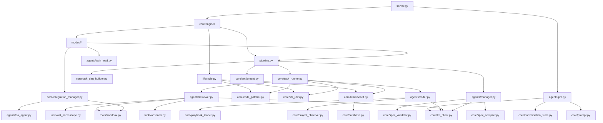

# ASTrea 全局模块拓扑

> 最后审计时间: 2026-04-29 | 基于 v1.7.0 Unlimited Architecture

---

## 1. 分层架构总览

```
┌─────────────────────────────────────────────────────────────────┐
│                      Layer 0: 入口层                             │
│  server.py (36KB)  ←→  main.py (2KB)                           │
│  FastAPI HTTP/WebSocket  │  Uvicorn 启动器                      │
└────────────┬───────────────────────────┬────────────────────────┘
             │ /api/chat                 │ /api/run
             ▼                           ▼
┌────────────────────────┐  ┌────────────────────────────────────┐
│  Layer 1A: 对话网关     │  │  Layer 1B: 执行引擎 (Facade)        │
│  agents/pm.py (118KB)  │  │  core/engine/__init__.py (6KB)     │
│  PMAgent               │  │  AstreaEngine                      │
│  - _classify_intent()  │──│  - run(requirement, mode)          │
│  - chat() → PMResponse │  │  - resume() / abort_and_rollback() │
└────────────────────────┘  └──────────┬─────────────────────────┘
                                       │
             ┌─────────────────────────┼─────────────────────────┐
             ▼                         ▼                         ▼
┌────────────────────┐  ┌────────────────────┐  ┌────────────────────┐
│  lifecycle.py (7KB)│  │  pipeline.py (21KB)│  │  modes/ (62KB)     │
│  构造/恢复/Git/Agent│  │  Planning/Execution│  │  create/patch/     │
│  延迟获取           │  │  /Settlement       │  │  extend/continue/  │
│                    │  │                    │  │  rollback          │
└────────────────────┘  └────────┬───────────┘  └────────────────────┘
                                 │
             ┌───────────────────┼───────────────────┐
             ▼                   ▼                   ▼
┌────────────────────┐┌────────────────────┐┌────────────────────────┐
│ Layer 2: Agent 层   ││ Layer 3: 核心基建   ││ Layer 4: 工具层         │
│ 10 个智能体         ││ Blackboard/VFS/DAG ││ Sandbox/Git/AST       │
│ (详见 agent_registry)││ /Patcher/Runner   ││                        │
└────────────────────┘└────────────────────┘└────────────────────────┘
```

---

## 2. 模块清单 — 按层级

### Layer 0: 入口层

| 模块 | 体积 | 职责 | 关键接口 |
|------|------|------|----------|
| `server.py` | 36KB | FastAPI 主服务: HTTP+WebSocket 端点 | `POST /api/chat`, `POST /api/run`, `WS /ws` |
| `main.py` | 2KB | Uvicorn 启动入口 | `uvicorn server:app` |

### Layer 1: 引擎层

| 模块 | 体积 | 职责 | 关键接口 |
|------|------|------|----------|
| `core/engine/__init__.py` | 6KB | Facade: 路由分发到子模块 | `run()`, `resume()`, `abort_and_rollback()` |
| `core/engine/lifecycle.py` | 7KB | 构造/恢复/Git HEAD/Agent 延迟获取 | `init_engine()`, `resume_engine()`, `abort_and_rollback()` |
| `core/engine/pipeline.py` | 21KB | 三阶段管道: Planning→Execution→Settlement | `phase_planning()`, `phase_execution()`, `phase_settlement()` |
| `core/engine/modes/create.py` | 6KB | Create 模式: 全量新建 | `run_create_mode()` |
| `core/engine/modes/patch.py` | 17KB | Patch 模式: 差量微调 + TechLead 前置 + Mini QA | `run_patch_mode()` |
| `core/engine/modes/extend.py` | 19KB | Extend 模式: 新增模块/Phase | `run_extend_mode()` |
| `core/engine/modes/continue_mode.py` | 12KB | Continue 模式: QA 闭环修复 | `run_continue_mode()` |
| `core/engine/modes/rollback.py` | 7KB | Rollback 模式: Git 回滚 | `run_rollback_mode()` |

### Layer 2: Agent 层

| 模块 | 体积 | 角色 | 唤醒时机 |
|------|------|------|----------|
| `agents/pm.py` | 118KB | PM 化身: 用户唯一对话窗口 | 每条用户消息 |
| `agents/manager.py` | 99KB | 项目经理: Spec 生成 + Task 拆解 | Phase 1 规划 |
| `agents/coder.py` | 45KB | 编码者: 代码生成/编辑 | Phase 2 每个 Task |
| `agents/reviewer.py` | 163KB | 审查者: L0 确定性 + L1 语义审计 | Phase 2 每个 Task |
| `agents/tech_lead.py` | 28KB | 技术总监: 跨文件仲裁/白盒调查 | Patch 前置 / 跨文件冲突 |
| `agents/qa_agent.py` | 31KB | QA: 集成端点验证 | Phase 2.5 集成测试 |
| `agents/integration_tester.py` | 50KB | 集成测试执行器 | Phase 2.5 |
| `agents/auditor.py` | 6KB | 审计员: 交付后合规检查 | Phase 3 结算 |
| `agents/planner_lite.py` | 4KB | 轻量规划器 (已降级) | PM 阶段 plan.md 生成 |
| `agents/synthesizer.py` | 9KB | 综合器: 多源信息合成 | 复杂任务上下文组装 |

### Layer 3: 核心基建

| 模块 | 体积 | 职责 |
|------|------|------|
| `core/blackboard.py` | 43KB | **SSOT**: Pydantic 状态模型 + 任务账本 + 烂账追踪 |
| `core/task_runner.py` | 55KB | TDD 状态机执行器: Coder→Patcher→Reviewer 闭环 |
| `core/code_patcher.py` | 11KB | 代码缝合: SEARCH/REPLACE + 全量覆写 |
| `core/database.py` | 49KB | PostgreSQL 持久化: 事件/轨迹/文件树/Checkpoint |
| `core/llm_client.py` | 17KB | 多 Provider LLM 路由: Token 监控 + 熔断 |
| `core/prompt.py` | 78KB | 全量 Prompt 模板库 |
| `core/spec_compiler.py` | 42KB | Spec 编译器: 用户需求→结构化蓝图 |
| `core/spec_validator.py` | 40KB | Spec 校验器: 合同闭环检查 |
| `core/task_dag_builder.py` | 22KB | DAG 构建: 依赖拓扑排序 + 批次调度 |
| `core/route_topology.py` | 20KB | API 路由拓扑: AST 提取 endpoint + 冲突检测 |
| `core/project_observer.py` | 33KB | 项目观察者: 上下文组装 + 依赖注入 |
| `core/playbook_loader.py` | 25KB | Playbook 加载: 技术栈铁律注入 |
| `core/integration_manager.py` | 41KB | 集成管理: 启动验证 + 端点测试 + replan |
| `core/state_manager.py` | 14KB | VFS 状态管理: LRU 缓存 + 隔离 |
| `core/settlement.py` | 9KB | 结算引擎: 异步后处理 + Git 提交 |
| `core/audit_guard.py` | 22KB | 审计守卫: 结构化报告生成 |
| `core/conversation_store.py` | 6KB | FTS5 对话存储: SQLite 全文检索 |
| `core/project_scanner.py` | 11KB | 项目扫描: 文件树 + 快照生成 |
| `core/ws_broadcaster.py` | 3KB | WebSocket 广播: 前端实时事件推送 |
| `core/vfs_utils.py` | 4KB | VFS 工具: 沙箱/真理区 读写 |
| `core/skill_runner.py` | 11KB | 技能执行器: 预置技能调用 |
| `core/js_ast_parser.py` | 5KB | JS/Vue AST 解析 |
| `core/patch_mini_qa.py` | 17KB | Patch Mini QA: 浏览器局部验证 |
| `core/techlead_scope.py` | 16KB | TechLead 作用域: 目标文件定位 |

### Layer 4: 工具层

| 模块 | 体积 | 职责 |
|------|------|------|
| `tools/sandbox.py` | 46KB | 沙箱执行: 进程隔离 + 超时控制 |
| `tools/observer.py` | 39KB | 文件观察: AST 骨架提取 + Schema/Routes 解析 |
| `tools/ast_microscope.py` | 25KB | AST 显微镜: 精确行号定位 + 符号解析 |
| `tools/explorer.py` | 7KB | 文件浏览: 目录扫描 + 内容读取 |
| `tools/git_ops.py` | 7KB | Git 操作: commit/reset/diff |
| `tools/project_scanner.py` | 15KB | 项目扫描器 (tools 层副本) |
| `tools/package_map.py` | 4KB | 包映射: npm/pip 依赖分析 |
| `tools/sandbox_browser.py` | 3KB | 浏览器沙箱: Playwright 集成 |

---

## 3. 核心数据流

### 3.1 Create 模式完整流

```
User Message
    │
    ▼
PMAgent.chat()
    │ _classify_intent() → Tool Calling 路由
    ▼
PMAgent._handle_create()
    │ _generate_plan() → plan.md
    │ _save_plan_to_disk()
    ▼
AstreaEngine.run(mode="create")
    │
    ├─ Phase 1: phase_planning()
    │   ├─ ManagerAgent._generate_project_spec()     → Spec 蓝图
    │   ├─ SpecCompiler.compile()                     → 结构化 JSON
    │   ├─ SpecValidator.validate()                   → 合同闭环检查
    │   ├─ ManagerAgent.plan_tasks()                  → Raw Tasks
    │   └─ TaskDagBuilder.build_plan()                → DAG + 拓扑排序
    │       └─ Blackboard.set_tasks()                 → 任务贴上黑板
    │
    ├─ Phase 2: phase_execution()
    │   └─ while not all_done:
    │       ├─ Blackboard.get_next_runnable_task()    → 依赖图调度
    │       └─ TaskRunner.execute(task)
    │           ├─ [Skeleton] _invoke_coder_skeleton() → 骨架生成
    │           │   └─ ReviewerAgent.review_skeleton() → L0 验收
    │           │       └─ VFS.commit_to_truth()       → 骨架写入真理区
    │           └─ [Fill] TDD Loop:
    │               ├─ CoderAgent.generate_code()      → 代码草稿
    │               ├─ CodePatcher.patch()              → 缝合
    │               ├─ VFS.write_to_sandbox()           → 写入沙箱
    │               ├─ ReviewerAgent.review()           → L0+L1 审查
    │               │   ├─ PASS → VFS.commit_to_truth() + DONE
    │               │   └─ FAIL → 回到 Coder (retry)
    │               └─ 熔断检测 (retry >= MAX_RETRIES → FUSED)
    │
    ├─ Phase 2.5: IntegrationManager
    │   ├─ run_startup_check()                        → 进程启动验证
    │   └─ run_integration_test()                     → 端点逐一验证
    │       └─ 失败 → try_startup_self_repair()       → 定向修复
    │
    └─ Phase 3: phase_settlement()
        ├─ project_scanner.scan_existing_project()    → 实时地图
        ├─ Blackboard.append_round_summary()          → 演进脚印
        ├─ persist_blackboard_artifacts()              → 落盘
        └─ SettlementEngine.run_async()               → 异步结算
```

### 3.2 Patch 模式流 (差异点)

```
PMAgent._handle_patch()
    │ PM 影响分析注入
    ▼
AstreaEngine.run(mode="patch")
    │
    ├─ TechLead 前置白盒调查
    │   └─ TechLeadAgent.investigate() → 根因诊断
    │
    ├─ ManagerAgent.plan_patch() → 受影响文件列表
    │   └─ (无 Spec 生成, 无 Sandbox 预热)
    │
    ├─ phase_execution() → TDD 循环 (同上)
    │
    └─ _run_patch_mini_qa_gate() → 浏览器局部 QA
```

### 3.3 PM 意图路由流

```
user_message
    │
    ▼
PMAgent._classify_intent()
    │ 100% LLM Tool Calling (零正则)
    │ 5 个路由工具:
    │   ├─ execute_project_task(mode=create|modify|continue|rollback|audit)
    │   ├─ route_to_revise_plan()
    │   ├─ reply_to_chat()
    │   ├─ ask_for_clarification()
    │   └─ search_archive()
    ▼
PMAgent._dispatch_route()
    │
    ├─ create  → _handle_create()  → plan.md 生成 → 等待确认
    ├─ modify  → _handle_patch()   → PM 影响分析 → Engine.run(patch)
    ├─ continue→ _handle_continue()→ QA 修复 / Phase 续期
    ├─ rollback→ _handle_rollback()→ Git 回滚
    ├─ audit   → _handle_audit()   → 审计报告
    ├─ chat    → _handle_chat()    → 人格化回复
    └─ revise  → _handle_plan_revision() → plan 增量修订
```

---

## 4. 状态机定义

### 4.1 项目级状态 (`ProjectStatus`)

```
INIT → PLANNING → EXECUTING → COMPLETED
                           ↘ DELIVERED_WITH_WARNINGS
                    ↘ FAILED
```

### 4.2 任务级状态 (`TaskStatus`) — TDD 循环

```
TODO → CODING → [CodePatcher]
                    ├─ 成功 → PENDING_REVIEW → REVIEWING
                    │                              ├─ PASS → PASSED → DONE
                    │                              └─ FAIL → REJECTED → (回到 CODING)
                    └─ 失败 → PATCH_FAILED → (回到 CODING)

retry >= MAX_RETRIES → FUSED (熔断)
```

### 4.3 PM 状态机

```
idle → (任何消息) → LLM 路由 → idle
     → (create 意图) → wait_confirm (待确认方案)
     → (确认) → 触发 Engine → idle
     → (驳回/修订) → 重新生成 plan → wait_confirm
```

---

## 5. 关键依赖图



---

## 6. 磁盘布局

```
Agent/
├── server.py                    # FastAPI 主服务
├── main.py                      # Uvicorn 入口
├── agents/                      # 10 个智能体
│   ├── pm.py                    # PM 化身 (118KB, 最大单文件)
│   ├── manager.py               # 项目经理 (99KB)
│   ├── coder.py                 # 编码者 (45KB)
│   ├── reviewer.py              # 审查者 (163KB, 系统最大文件)
│   ├── tech_lead.py             # 技术总监 (28KB)
│   ├── qa_agent.py              # QA (31KB)
│   ├── integration_tester.py    # 集成测试 (50KB)
│   ├── auditor.py               # 审计员 (6KB)
│   ├── planner_lite.py          # 轻量规划器 (4KB)
│   └── synthesizer.py           # 综合器 (9KB)
├── core/                        # 核心基建
│   ├── engine/                  # Engine Facade
│   │   ├── __init__.py          # Facade 入口
│   │   ├── lifecycle.py         # 生命周期
│   │   ├── pipeline.py          # 三阶段管道
│   │   ├── helpers.py           # 工具函数
│   │   └── modes/               # 5 种执行模式
│   ├── blackboard.py            # SSOT 黑板
│   ├── task_runner.py           # TDD 执行器
│   ├── code_patcher.py          # 代码缝合
│   ├── database.py              # PostgreSQL
│   ├── llm_client.py            # LLM 路由
│   ├── prompt.py                # Prompt 库
│   ├── spec_compiler.py         # Spec 编译
│   ├── spec_validator.py        # Spec 校验
│   ├── task_dag_builder.py      # DAG 构建
│   ├── route_topology.py        # 路由拓扑
│   ├── project_observer.py      # 观察者
│   ├── playbook_loader.py       # Playbook
│   ├── integration_manager.py   # 集成管理
│   ├── state_manager.py         # VFS 状态
│   ├── settlement.py            # 结算
│   ├── audit_guard.py           # 审计守卫
│   ├── conversation_store.py    # FTS5 存储
│   ├── ws_broadcaster.py        # WebSocket
│   ├── vfs_utils.py             # VFS 工具
│   └── ...                      # 其余辅助模块
├── tools/                       # 底层工具
│   ├── sandbox.py               # 沙箱 (46KB)
│   ├── observer.py              # AST 观察 (39KB)
│   ├── ast_microscope.py        # AST 显微镜 (25KB)
│   ├── git_ops.py               # Git 操作
│   └── ...
├── config/                      # 配置
├── playbooks/                   # 技术栈 Playbook
├── frontend/                    # 前端 (Vue/React)
├── projects/                    # 生成项目存储
├── ASTrae_map/                  # ← 本文档所在
└── docs/                        # 补充文档
```

---

## 7. 代码规模统计

| 层级 | 文件数 | 总体积 | 备注 |
|------|--------|--------|------|
| 入口层 | 2 | ~39KB | server.py + main.py |
| 引擎层 | 7 | ~68KB | Facade + lifecycle + pipeline + 5 modes |
| Agent 层 | 10 | ~553KB | reviewer.py 最大 (163KB) |
| 核心基建 | 25 | ~545KB | prompt.py 最大 (78KB) |
| 工具层 | 8 | ~148KB | sandbox.py 最大 (46KB) |
| **合计** | **52** | **~1.35MB** | 纯 Python 源码 |
